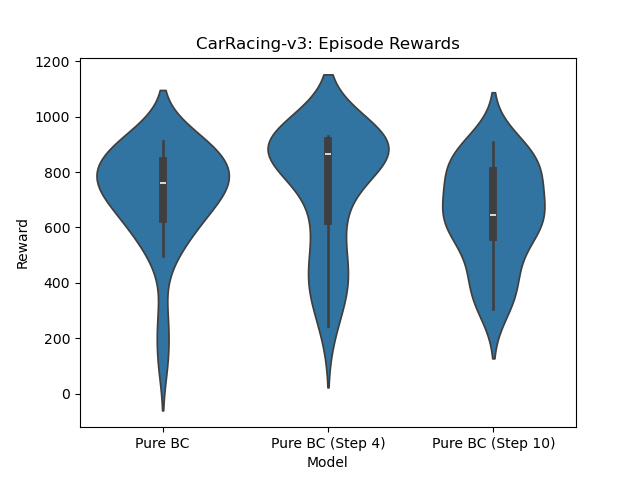

# Imitation learning experiment

- td3 bc
- attention viz
- tables


## Results: regular

<!-- BC + Pretrained Critic: Mean Reward: 472.99 +/- 40.92, med: 463.40
Pure BC: Mean Reward: 763.90 +/- 31.39, med: 839.71
Fine-Tuned from BC: Mean Reward: 745.49 +/- 33.96, med: 816.01
Fine-Tuned from BC + Pretrained Critic: Mean Reward: 265.97 +/- 62.43, med: 160.16
Baseline PPO: Mean Reward: 737.35 +/- 29.60, med: 805.75 -->


BC: Mean Reward: 730.77 +/- 37.98, med: 833.83
CAC: Mean Reward: 477.10 +/- 53.12, med: 470.24
FT BC: Mean Reward: 745.49 +/- 33.96, med: 816.01
FT CAC: Mean Reward: 265.97 +/- 62.43, med: 160.16
Base: Mean Reward: 737.35 +/- 29.60, med: 805.75

BC: Behavior Cloning
CAC: BC + Critic pretrain
FT X: Fine-tuned from X
Base: PPO baseline

## Results: frame skips


1: Pure BC: Mean Reward: 730.77 +/- 37.98, med: 833.83
4: Pure BC (Step 4): Mean Reward: 786.43 +/- 32.49, med: 874.60
10: Pure BC (Step 10): Mean Reward: 717.78 +/- 44.95, med: 873.09

### Results: frame skips, models on different step sizes

How well does a model trained on a certain frame skip generalize to other frame skips?

#### Step size: 1


Pure BC: Mean Reward: 730.77 +/- 37.98, med: 833.83
Pure BC (Step 4): Mean Reward: 623.27 +/- 37.52, med: 664.99
Pure BC (Step 10): Mean Reward: 564.61 +/- 36.57, med: 606.72

#### Step size: 4



Pure BC: Mean Reward: 718.22 +/- 32.85, med: 762.34
Pure BC (Step 4): Mean Reward: 742.81 +/- 39.45, med: 866.65
Pure BC (Step 10): Mean Reward: 652.69 +/- 31.86, med: 645.82

#### Step size: 10


Pure BC: Mean Reward: 305.89 +/- 28.24, med: 288.04
Pure BC (Step 4): Mean Reward: 686.68 +/- 45.42, med: 799.13
Pure BC (Step 10): Mean Reward: 744.27 +/- 40.36, med: 881.75

## Speed


## Input

- 4 stacked B/W frames of size 48x48
- frame step is 4, so e.g. observation 16 includes frames 16, 12, 8, 4


## Usage

```bash

python record.py # record expert data
python process_recorded_data.py # process expert data

python imi.py # BC
python imi_ac.py # BC + Critic pretrain
python finetune.py # finetune BC model
python finetune_ac.py # finetune BC + Critic pretrain model
python baseline.py # PPO baseline

python compare.py
```