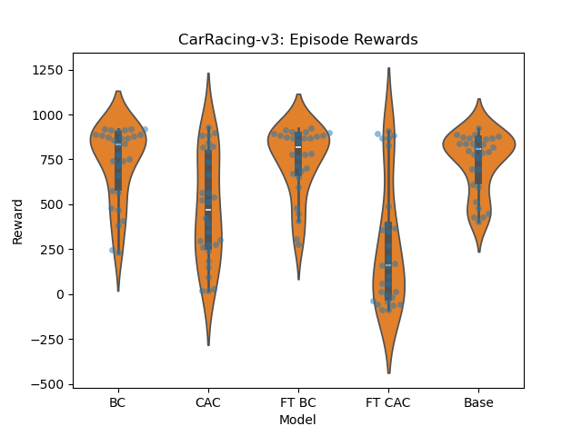
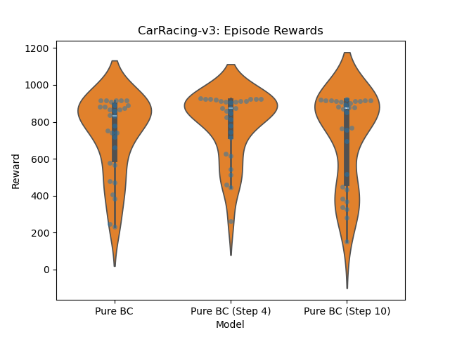
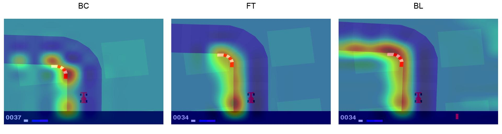
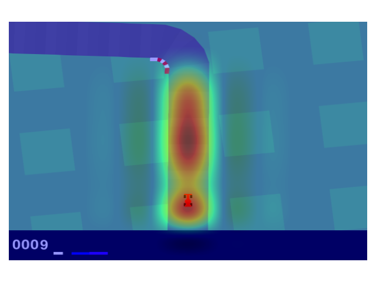
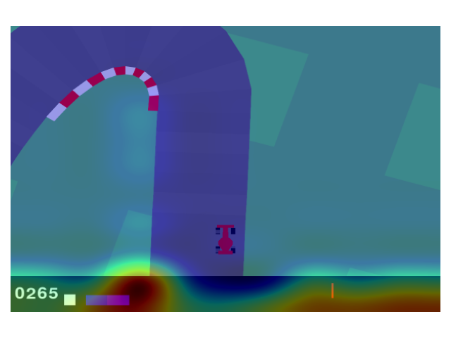
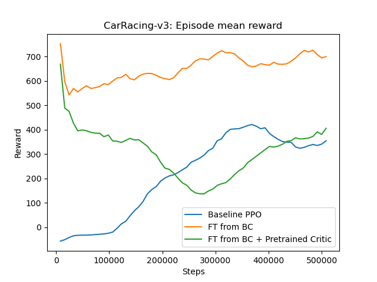
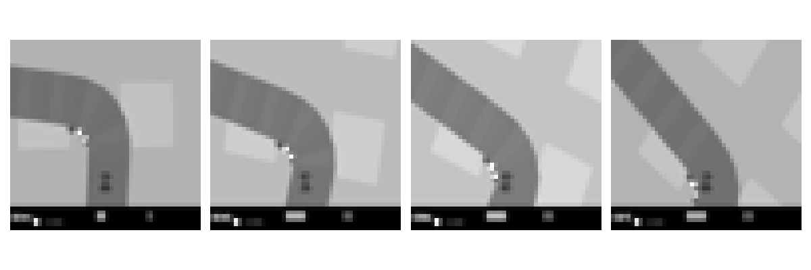

# Imitation learning experiment

### Results: Regular

| Model       | Mean Reward      | Std Err   | Median  |
|-------------|------------------|-----------|---------|
| **BC**      | 730.77           | ± 37.98   | 833.83  |
| **CAC**     | 477.10           | ± 53.12   | 470.24  |
| **FT BC**   | 745.49           | ± 33.96   | 816.01  |
| **FT CAC**  | 265.97           | ± 62.43   | 160.16  |
| **Base**    | 737.35           | ± 29.60   | 805.75  |
---



Pure BC is the strongest model.
Finetuned BC performs almost as well. 
Pretrained actor-critic models perform worse, but definitely better than random.


### Results: Frame Skips

Frame skip indicates how many frames are skipped between each frame in the stacked observation.

| Step Size | Model                 | Mean Reward      | Std Err   | Median  |
|-----------|-----------------------|------------------|-----------|---------|
| 1         | Pure BC              | 730.77           | ± 37.98   | 833.83  |
| 4         | Pure BC (Step 4)     | 786.43           | ± 32.49   | 874.60  |
| 10        | Pure BC (Step 10)    | 717.78           | ± 44.95   | 873.09  |

---


4-step model seems to perform the best, but the difference is not significant.

### Results: Frame Skips (Generalization)

How well does the model generalize to different frame skips than it was trained on?

#### Step Size: 1

| Model                | Mean Reward      | Std Err   | Median  |
|----------------------|------------------|-----------|---------|
| Pure BC              | 730.77           | ± 37.98   | 833.83  |
| Pure BC (Step 4)     | 623.27           | ± 37.52   | 664.99  |
| Pure BC (Step 10)    | 564.61           | ± 36.57   | 606.72  |
---

#### Step Size: 4

| Model                | Mean Reward      | Std Err   | Median  |
|----------------------|------------------|-----------|---------|
| Pure BC              | 718.22           | ± 32.85   | 762.34  |
| Pure BC (Step 4)     | 742.81           | ± 39.45   | 866.65  |
| Pure BC (Step 10)    | 652.69           | ± 31.86   | 645.82  |

---

#### Step Size: 10

| Model                | Mean Reward      | Std Err   | Median  |
|----------------------|------------------|-----------|---------|
| Pure BC              | 305.89           | ± 28.24   | 288.04  |
| Pure BC (Step 4)     | 686.68           | ± 45.42   | 799.13  |
| Pure BC (Step 10)    | 744.27           | ± 40.36   | 881.75  |

---


## CAM



Cam for turning left for each model. The models is focusing on the inner side of the curve.



Cam for starting (BC model). The model is focusing on the road ahead.



Cam for a sharp turn in high speed (BC model). The model is focusing on the speedometer, probably to decide if it should brake or not.

## Speed



Initializing the model with BC weights gives significant boost in the beginning.
For some reason these rewards differ significantly from the ones in the table, which were calculated using `evaluate_policy`.

## Input

- 4 stacked B/W frames of size 48x48
- frame step is 4, so e.g. observation 16 includes frames 16, 12, 8, 4



## Usage

```bash

python record.py # record expert data
python process_recorded_data.py # process expert data

python imi.py # BC
python imi_ac.py # BC + Critic pretrain
python finetune.py # finetune BC model
python finetune_ac.py # finetune BC + Critic pretrain model
python baseline.py # PPO baseline

python compare.py
```